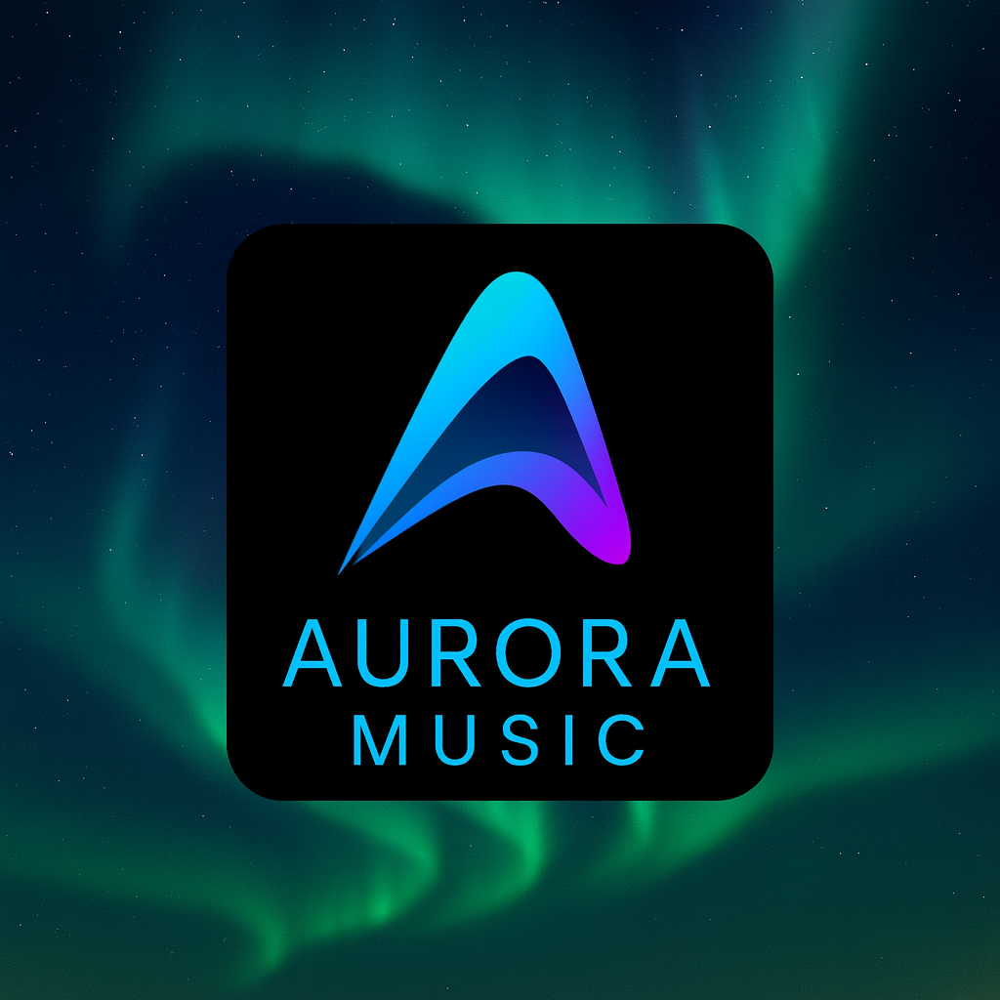

### App Icon

# AuroraMusic  
AI‑enhanced karaoke experience — simple, fun, and portable.

---

## 🚀 Vision  
AuroraMusic brings modern karaoke to everyone.  
With AI‑powered vocal enhancement, smart pitch guidance, and a clean interface, AuroraMusic makes singing more fun, more accessible, and more creative.

More details: Vision

---

## ✅ Features (MVP)  
🎤 Karaoke playback  
🎚️ AI‑based vocal enhancement  
📈 Live pitch visualization  
🎵 Song library (local)  
🌙 Dark/Light mode  
🔐 Secure authentication  

More details: Features

---

## 🧠 Architecture  
AuroraMusic is built on a modular, scalable architecture:

- Mobile App (Flutter)  
- Audio Engine (Dart + native plugins)  
- AI Layer (pitch detection, vocal enhancement)  
- Cloud Storage (optional)  
- Security Layer (auth, permissions)

More details: Architecture

---

## 🔌 Audio/AI Plan  
- Pitch detection  
- Vocal enhancement  
- Reverb & effects  
- Timing analysis  
- Song metadata  
- Recording export  

More details: Audio/AI Plan

---

## 🖼️ App Icons  
AuroraMusic uses a gradient‑based icon aligned with the Aurora branding system.

All required sizes and formats:  
👉 App Icons Documentation

---

## 🗺️ Roadmap  
✅ Branding  
✅ GitHub setup  
⬜ Upload app icons  
⬜ Finalize MVP  
⬜ Build audio engine  
⬜ Implement pitch detection  
⬜ Start mobile app  
⬜ Beta release  
⬜ Launch v1.0  

More details: Roadmap

---

## 📬 Contact  
Founder: Miguel Marquez‑Tiegs  
GitHub: @AuroraStudiosHQ
